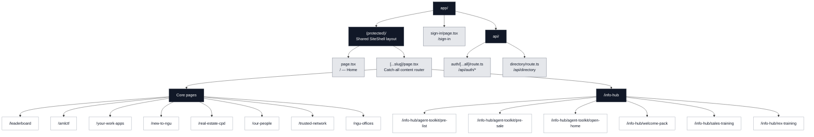
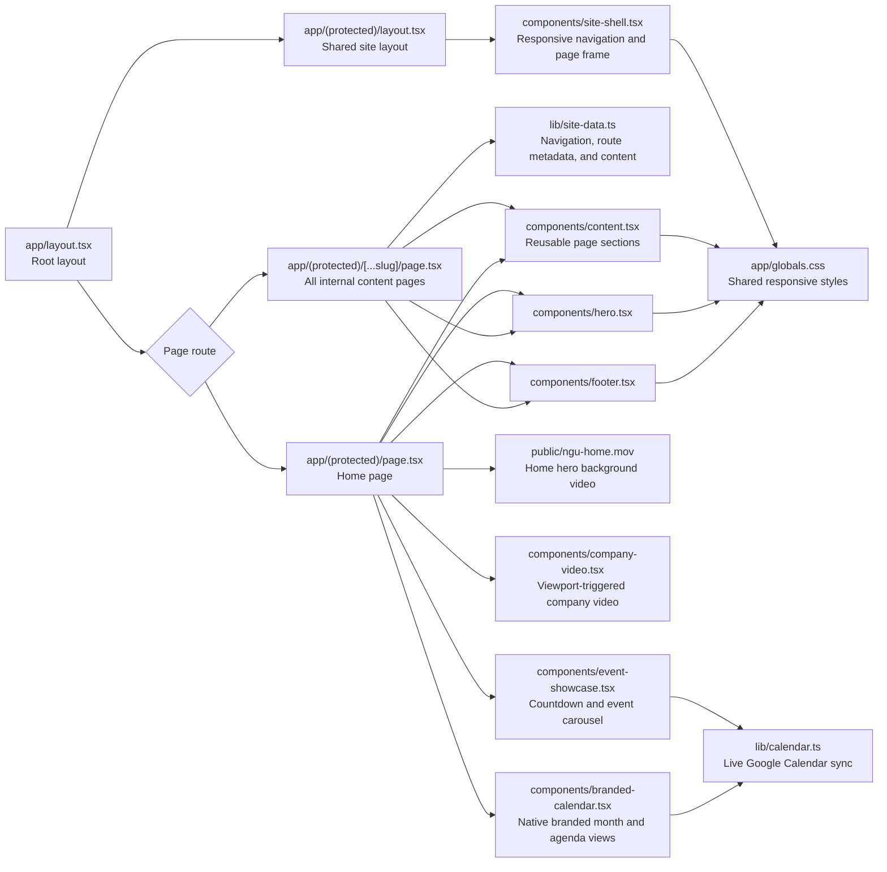

# NGU Hub Architecture

This document maps the private website hierarchy and the Next.js files that render it.

## Live directories and monthly award

The Our People and Trusted Network directories use `components/live-directory.tsx` and the read-only `/api/directory` endpoint. Google Sheets remains the source of truth. Tabs are discovered from the existing sheet, refreshed every five minutes, and rendered as native searchable tables. Supplier hyperlinks are preserved. Employment dates, internal staff groups, and labelled access credentials are not returned to the browser. No sheet permissions are changed. If Google removes anonymous read access, the view shows an error and a source-sheet link; authenticated Google access would then need separate setup.

The monthly award is currently maintained in `OurPeople` in `components/content.tsx`. An admin editor is not implemented, pending approval. A production editor still needs an administrator allowlist, persistent award records and image storage, with preview/publish controls.

The homepage video is served locally from `public/ngu-home.mov` (the supplied 39.5-second original), instead of Google's download-warning response. It autoplays muted, loops, and has no visible controls. Before a production deployment, transcode the 218 MB source to a smaller web-optimized MP4 and update `components/hero.tsx`.

## Website page file tree

The home page has its own route file. All other protected content pages are selected by the catch-all router from route metadata and specialised content components.

## Routing and component structure

## Rendering model

- Local development can use `LOCAL_DEV_ACCESS=true` to preview the protected Hub without Google OAuth or local Google credentials. The bypass is accepted only while `NODE_ENV=development` and `BETTER_AUTH_URL` points to `localhost`, `127.0.0.1`, or `[::1]`; Vercel production always requires its real Google credentials.
- `app/(protected)/layout.tsx` verifies the Better Auth session before applying the shared `SiteShell` to every Hub route. Google Workspace identities are limited to the `ngurealestate.com.au`, `nguteam.com`, and `ngugroup.com` domains, and sessions are stored in encrypted cookies.
- `app/(protected)/page.tsx` owns the bespoke home-page sections and loads upcoming events.
- `app/(protected)/[...slug]/page.tsx` converts the URL segments to a route key, rejects unknown routes with `notFound()`, and selects either data-driven content or a specialised component.
- `app/api/directory/route.ts` verifies the same server-side session before returning live directory data.
- `lib/calendar.ts` reads the public NGU Google Calendar feed, expands recurring events, and refreshes the home-page event data every five minutes.
- `components/event-showcase.tsx` renders the responsive carousel, live countdown, event artwork, and Google Meet link.
- `components/company-video.tsx` loads the NGU introduction video when its section enters the viewport and pauses it when it leaves.
- `components/branded-calendar.tsx` turns the live Google Calendar data into NGU-branded month and mobile agenda views while keeping event and meeting details synced.
- The home hero serves the supplied video locally from `public/ngu-home.mov`, with the city image retained as a loading fallback.
- `lib/site-data.ts` is the source of truth for navigation entries, simple page definitions, training lists, people, offices, and work-app groups.
- `components/content.tsx` contains the reusable and specialised content renderers used by the catch-all route.
- The old standalone Agent Toolkit index route has been retired. Its Pre-List, Pre-Sale and Open Home pages remain directly accessible and combine locally saved checklists, work-app links, the live supplier directory and marketing resources.
- Sales and Rex training use a selectable video-player layout backed by the dated links in `lib/training-data.ts`.
- `Hero` and `Footer` provide the shared content-page framing, while `SiteShell` owns desktop and mobile navigation.

## References

- [Repository instructions](./AGENTS.md)
- [@Visualize](plugin://visualize@openai-bundled)
